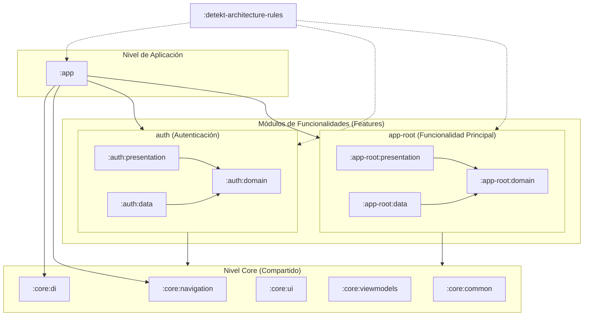

# Meet - Android Multi-Module Template

🌐 Idiomas:
- 🇬🇧 [English](README.md)
- 🇪🇸 Español (actual)

Este proyecto es una **plantilla base (template)** para aplicaciones Android moderna, diseñada con un enfoque en la escalabilidad, mantenibilidad y modularización. Utiliza una arquitectura **multi-módulo** robusta siguiendo los principios de **Clean Architecture**, permitiendo una separación clara de responsabilidades y facilitando el trabajo en equipo o el crecimiento del proyecto.

El objetivo de esta plantilla es proporcionar una estructura preconfigurada con las mejores prácticas de la industria, incluyendo inyección de dependencias, navegación moderna y estrictos controles de calidad de código.

---

# Arquitectura
### Diagrama de Módulos y Relaciones



### Resumen de la Estructura

* **`:app`**: Es el orquestador principal. Depende de todas las funcionalidades (`auth`, `app-root`) y configura la inyección de dependencias global y la navegación.
* **Funcionalidades (`auth`, `app-root`)**: Cada una está dividida internamente siguiendo Clean Architecture:
    * **`:presentation`**: Contiene la UI (Compose) y los ViewModels. Depende de `:domain`.
    * **`:data`**: Implementa los repositorios y fuentes de datos (API, Base de Datos). Depende de :domain.
    * **`:domain`**: El núcleo de la lógica de negocio (UseCases y Modelos). No tiene dependencias externas de capas superiores.
* **`:core`**: Contiene el código reutilizable por cualquier módulo (componentes UI comunes, utilidades de navegación, lógica base de ViewModels e inyección de dependencias).
* **`:detekt-architecture-rules`**: Módulo especializado para asegurar que las reglas de arquitectura se cumplan mediante análisis estático.

# Características
- Proyecto Multi-módulo
- Clean Architecture
- Koin
- Data Store
- Compose Navigation
- Detekt
- Reglas personalizadas de Detekt
- Hook de Pre-Commit para Detekt

### ¡Atención! 💥

Este proyecto contiene hooks de pre-commit y pre-push para asegurar la calidad del código. Es necesario realizar estos pasos para configurar el control de calidad:

1. Cambiar el hooksPath:

```bash
$ git config core.hooksPath .githooks
```

2. Dar permisos a los hooks:

```bash
$ chmod +x .git/hooks/pre-commit .git/hooks/pre-push
```

Para corregir los errores que reporte el hook `pre-commit`, ejecuta esto en la terminal:

```bash
$ ./gradlew detekt
```

# Kotzilla
Kotzilla es un SDK para monitorear y optimizar el rendimiento. Para configurarlo:

1. Localiza el archivo `app/kotzilla.sample.json`.
2. Crea una copia llamada `app/kotzilla.json` (este archivo está ignorado por Git para proteger tus claves).
3. Sustituye los valores de ejemplo por las credenciales reales de tu cuenta.

Para más información, asegúrate de tener instalado el plugin de Koin y conectado a tu cuenta.
