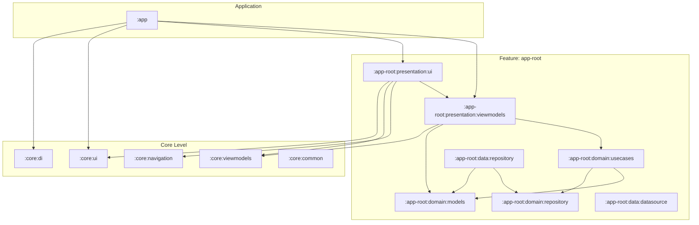

# Meet - Android Multi-Module Template

🌐 Languages:
- 🇬🇧 English (default)
- 🇪🇸 [Español](README.es.md)

> [!NOTE]
> **JDK 21** is required to compile this project.

This project is a modern Android **base template**, designed with a focus on scalability, maintainability, and modularization. It uses a robust **multi-module** architecture following **Clean Architecture** principles, allowing for a clear separation of concerns and facilitating teamwork or project growth.

The goal of this template is to provide a pre-configured structure with industry best practices, including dependency injection, modern navigation, and strict code quality controls.

> [!IMPORTANT]
> **Proof of Concept:** This project is a PoC exploring **extreme modularization**. Every single layer (datasource, repository, usecases, etc.) is isolated into its own Gradle module to ensure absolute architectural purity and total isolation.
> **Trade-off:** This approach results in high Gradle configuration overhead and significantly longer synchronization times. It is intended for educational purposes or extremely large-scale projects where strict boundary enforcement is a priority over build speed.

---

# Architecture
### Simplified Module and Relationship Diagram

> [!NOTE]
> For better readability, this diagram has been simplified: the **auth** feature is not shown, and direct dependencies from **:core:di** and **:core:common** to other modules have been omitted to reduce visual clutter.



### Structure Summary

* **`:app`**: The main orchestrator. It depends on all features (`auth`, `app-root`) and configures global dependency injection and navigation.
* **Features (`auth`, `app-root`)**: Each is internally divided following Clean Architecture:
  * **`:presentation`**: Contains the UI (Compose) and ViewModels. Depends on `:domain`.
  * **`:data`**: Implements repositories and data sources (API, Database). Depends on `:domain`.
  * **`:domain`**: The business logic core (UseCases and Models). No external dependencies from higher layers.
* **`:core`**: Contains reusable code for any module (common UI components, navigation utilities, ViewModel base logic, and dependency injection).
* **`:detekt-architecture-rules`**: Specialized module to ensure architecture rules are met through static analysis.

# Features
- Multi-module project
- Clean Architecture
- Koin
- Data Store
- Compose Navigation
- Detekt
- Detekt custom rules
- Detekt Pre-Commit Hook

### Warning!! 💥

This project contains a pre-commit and pre-push hook to ensure code quality. The following steps are necessary to setup the quality control:

1. Change hooksPath:

```bash
$ git config core.hooksPath .githooks
```

2. Add permissions to the hook:

```bash
$ chmod +x .git/hooks/pre-commit .git/hooks/pre-push
```

To fix the errors reported by the `pre-commit` hook, run this command in your terminal:

```bash
$ ./gradlew detekt
```

# Kotzilla
Kotzilla is an SDK for monitoring and optimizing performance. To set it up:

1. Locate `app/kotzilla.sample.json`.
2. Create a copy named `app/kotzilla.json` (this file is ignored by Git to protect your keys).
3. Replace the placeholder values with your actual account credentials.

For more information, ensure you have the Koin plugin installed and connected to your account.
